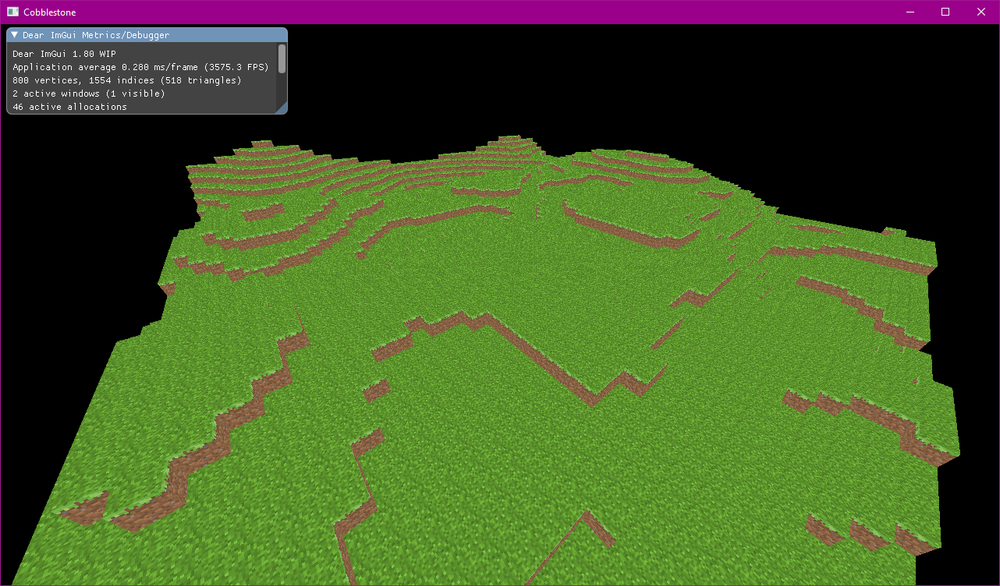

# Flex Engine
This is a game engine / renderer I work on during my free time (and when I feel like it)

right now, it's only a very simple Vulkan-based renderer, but I plan on slowly adding new features

# Setup
This has been tested with gcc on Fedora 33 and mingw on Windows 10 but should also work on other systems with CMake

### Compiling
You will need:
- [x] CMake
- [x] A C++17 capable compiler
- [x] SDL2 development libraries
- [x] Vulkan development libraries
- [x] OpenGL development libraries
- [x] GLEW development libraries
- [x] glm development libraries

### Running
To test this, just run the example1 target in CMake

Since this is development software, you may need some manual file copying in order to run the program correctly.

These files must be in your current directory:
- shaders/frag.spv
- shaders/vert.spv

in order to get the .spv files, you will need to run the compile-shaders command in the examples folder

__the script requires glslc to be installed on your system__

And with that done you should be getting something that looks like this:

